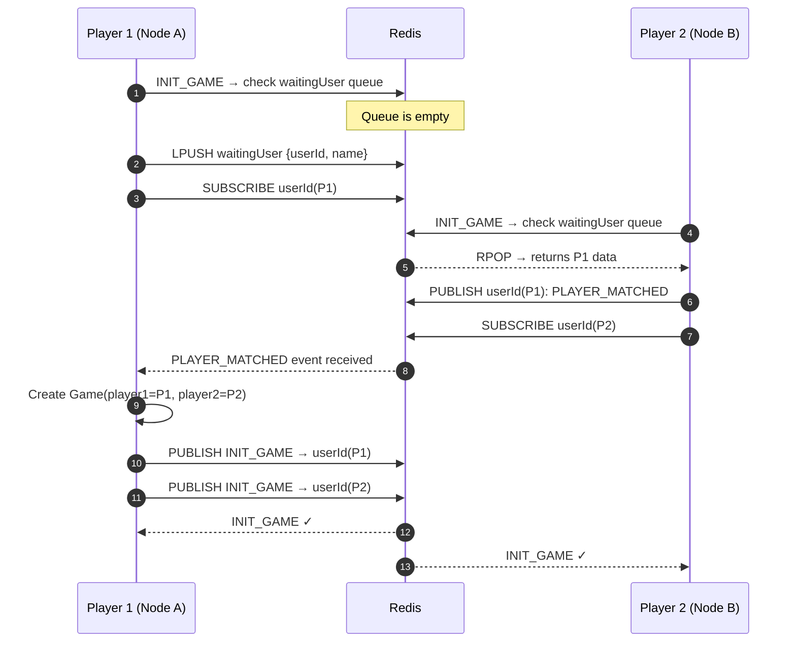
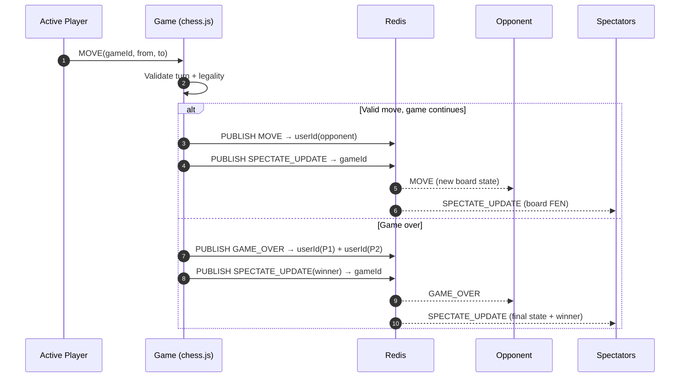
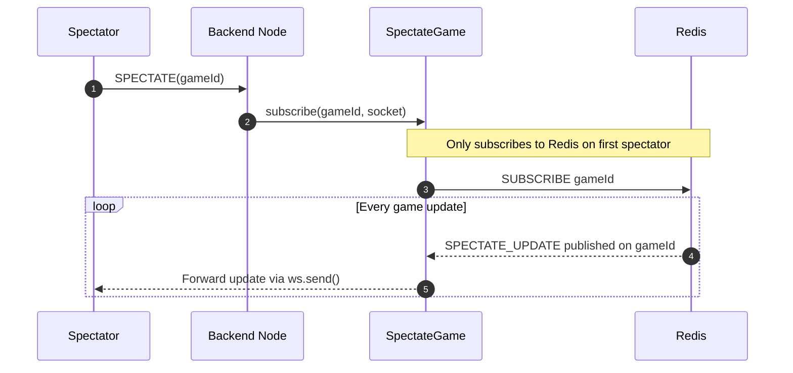

# Chess Backend Architecture

This backend uses **WebSockets + Redis Pub/Sub** to support real-time chess gameplay without sticky sessions.

Instead of forcing both players and spectators of a game to stay on the same WebSocket server instance, each backend instance communicates through Redis channels — allowing horizontal scaling while preserving real-time sync.

---

## Why Pub/Sub Over Sticky Sessions?

| Approach | Problem |
|---|---|
| Sticky Sessions | Traffic for a specific game must always land on the same server. Hard to scale, especially for spectator-heavy games. |
| Redis Pub/Sub ✅ | Any backend instance can accept any WebSocket connection. Events route through Redis channels to the right users, regardless of which node they're on. |

---

## High-Level Architecture

```
┌─────────────────────────────────────────────────────────────────┐
│                        CLIENTS                                  │
│                                                                 │
│   [Player A]          [Player B]          [Spectator]           │
│       │                   │                    │                │
└───────┼───────────────────┼────────────────────┼────────────────┘
        │ WebSocket         │ WebSocket           │ WebSocket
        ▼                   ▼                     ▼
┌───────────────┐  ┌───────────────┐  ┌───────────────────────┐
│  Backend      │  │  Backend      │  │  Backend              │
│  Instance 1   │  │  Instance 2   │  │  Instance 3           │
│               │  │               │  │                       │
│ GameManager   │  │ GameManager   │  │ GameManager           │
│ WaitingQueue  │  │ WaitingQueue  │  │ WaitingQueue          │
│ RedisPublisher│  │ RedisPublisher│  │ RedisPublisher        │
│ RedisSubscrib.│  │ RedisSubscrib.│  │ RedisSubscrib.        │
│ Game(chess.js)│  │ SpectateGame  │  │ SpectateGame          │
└───────┬───────┘  └───────┬───────┘  └──────────┬────────────┘
        │                  │                      │
        └──────────────────┴──────────────────────┘
                                  │
                    ┌─────────────▼─────────────┐
                    │                           │
                    │         R E D I S         │
                    │                           │
                    │  Channels:                │
                    │  • userId:{id}  (private) │
                    │  • gameId:{id}  (public)  │
                    │  • waitingUser  (queue)   │
                    │                           │
                    └───────────────────────────┘
```

---

## Core Components

```
src/
├── index.ts           →  HTTP server (/all-games) + WebSocket server entry point
├── GameManager.ts     →  Main orchestrator: routes INIT_GAME, MOVE, SPECTATE events
├── WaitingUserQueue.ts→  Redis-backed matchmaking queue (LPUSH / RPOP)
├── RedisPublisher.ts  →  Publishes events to userId / gameId channels
├── RedisSubscriber.ts →  Subscribes sockets to userId channels; handles PLAYER_MATCHED
├── Game.ts            →  Owns chess.js instance, validates moves, publishes game events
├── Spectate.ts        →  Subscribes spectators to gameId channels; fans out updates
└── Messages.ts        →  Shared message type constants
```

---

## Redis Channel Design

```
┌────────────────────────────────────────────────────┐
│                   Redis Channels                   │
│                                                    │
│  userId:{playerA}  ──►  private, direct messages   │
│       Events: PLAYER_MATCHED, INIT_GAME,           │
│               MOVE, GAME_OVER                      │
│                                                    │
│  userId:{playerB}  ──►  private, direct messages   │
│                                                    │
│  gameId:{game1}    ──►  public broadcast channel   │
│       Events: SPECTATE_UPDATE                      │
│       Consumers: all spectators of this game       │
│                                                    │
│  waitingUser       ──►  Redis list (matchmaking)   │
│       LPUSH when player waits                      │
│       RPOP when opponent arrives                   │
└────────────────────────────────────────────────────┘
```

---

## End-to-End Flows

### 1. Matchmaking Flow



---

### 2. Move Propagation Flow



---

### 3. Spectator Subscription Flow



---

## Message Types

| Message | Direction | Description |
|---|---|---|
| `INIT_GAME` | Server → Client | Game initialized, sends color + opponent info |
| `MOVE` | Client → Server | Player submits a move |
| `MOVE` | Server → Client | Opponent's move delivered |
| `GAME_OVER` | Server → Client | Game ended with result |
| `SPECTATE` | Client → Server | Request to spectate a game |
| `SPECTATE_UPDATE` | Server → Spectators | Board state broadcast after each move |
| `GAME_ENDED` | Server → Client | Game cleanup notification |
| `PLAYER_MATCHED` | Redis internal | Matchmaking signal between backend nodes |

---

## API & WebSocket Surface

**HTTP**
```
GET /all-games   →  Returns active game IDs from in-memory GameManager state
```

**WebSocket Inbound**
```
init_game   { name }
move        { gameId, from, to }
spectate    { gameId }
```

**WebSocket Outbound** *(via Redis fan-out)*
```
init_game        player_matched      move
spectate_update  game_over           game_ended
```

---

## Scalability

### What this architecture gives you

```
✅  Decoupled event routing — no single backend bottleneck
✅  Horizontal scaling — add backend instances freely, no sticky affinity needed
✅  Spectator fan-out — gameId channels broadcast to unlimited spectators
✅  Matchmaking across nodes — players on different instances get paired via Redis queue
```

### Current limitations

```
⚠️  Game state is in-process memory (GameManager.games)
     → /all-games only shows games on the queried instance
     → If the owning process restarts, game state is lost

To go fully multi-node: move authoritative game state to shared storage
(Redis Hash / DB / event log) so any node can rehydrate and execute game logic.
```

---

## Run Locally

```bash
# 1. Configure environment
cp .env.example .env
# Fill in Redis credentials in .env

# 2. Install dependencies
npm install

# 3. Build and start
npm run build
node dist/index.js
```

Server starts on `http://localhost:3000`. WebSocket upgrades are served on the same port.