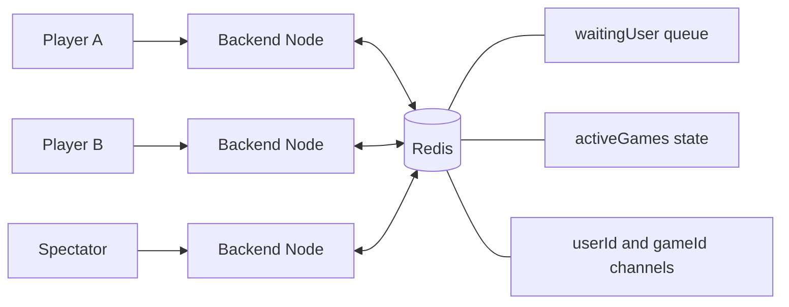
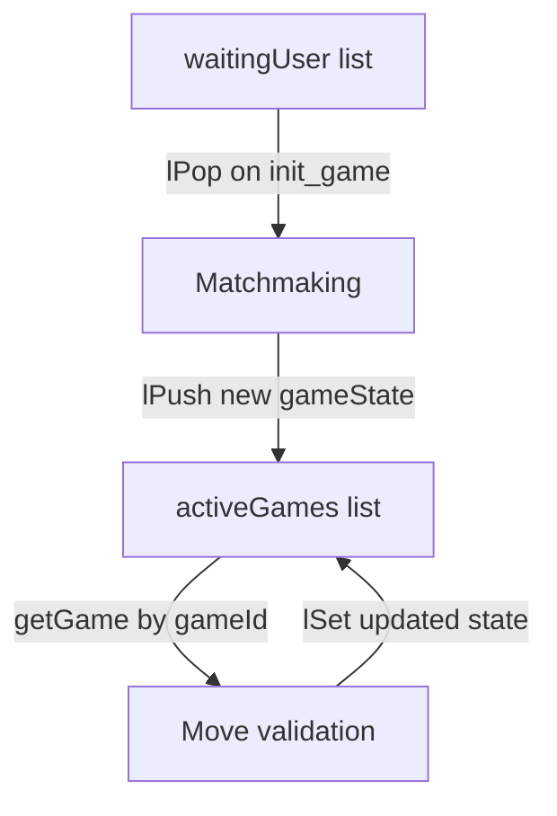
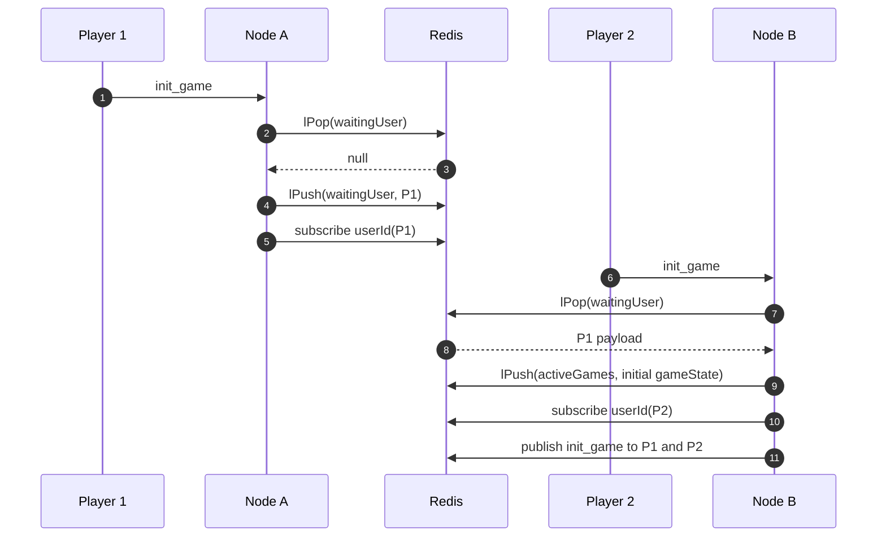
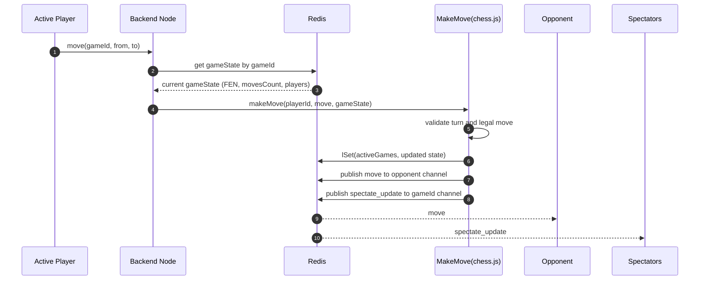
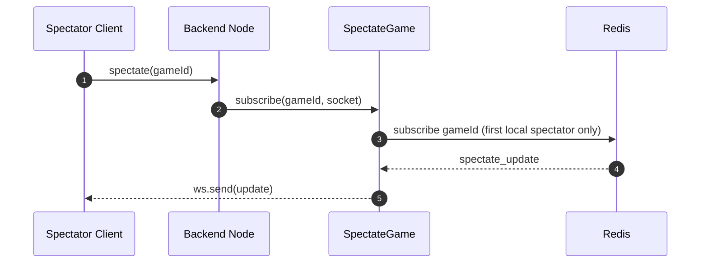

# Chess Backend Architecture

This backend uses WebSockets plus Redis to support real-time multiplayer chess and spectators without sticky sessions.

Any backend instance can accept a socket connection. Redis is used for matchmaking, shared game state, and message fan-out.

---

## Single Source Of Truth

The authoritative game state is in Redis, not in node-local in-memory `Game` objects.

Each active game is stored in Redis (`activeGames`) as a `gameStateType` object.

| Field | Type | Meaning |
|---|---|---|
| `gameId` | string | Unique game identifier |
| `game` | string | Current board FEN |
| `player1Id`, `player2Id` | string | Player identities |
| `player1Name`, `player2Name` | string | Display names |
| `isPlayer1Connected`, `isPlayer2Connected` | boolean | Live connection flags |
| `status` | string | `active` / `inactive` / `ended` |
| `movesCount` | number | Move counter for turn tracking |

Every backend node reads and writes this same Redis state, so all nodes observe one board timeline per game.

---

## Why Pub/Sub Over Sticky Sessions?

| Approach | Problem |
|---|---|
| Sticky Sessions | Traffic for a game must always land on one server. This limits flexibility and complicates scaling. |
| Redis Pub/Sub | Any node can serve clients while Redis routes events to players and spectators. |

---

## High-Level Architecture



---

## Core Components

| File | Responsibility | State ownership |
|---|---|---|
| `backend/src/index.ts` | HTTP + WebSocket entrypoint | None |
| `backend/src/GameManager.ts` | Handles `init_game`, `move`, `spectate`, disconnect flow | User socket map only |
| `backend/src/WaitingUserQueue.ts` | Matchmaking queue operations | Redis `waitingUser` |
| `backend/src/RedisGameManager.ts` | Game state reads and writes | Redis `activeGames` |
| `backend/src/MakeMove.ts` | Move validation and state transition | Reads/writes Redis game state |
| `backend/src/RedisPublisher.ts` | Publishes direct and broadcast events | Redis pub/sub |
| `backend/src/RedisSubscriber.ts` | Subscribes user channels and forwards to sockets | Local subscription map |
| `backend/src/Spectate.ts` | Spectator subscriptions per game channel | Local spectator map |
| `backend/src/utils/Messages.ts` | Message constants and `gameStateType` | Shared types |

---

## Redis Data Model

| Redis key/channel | Type | Producer | Consumer | Purpose |
|---|---|---|---|---|
| `waitingUser` | List | `WaitingUserQueue.addWaitingUser` | `WaitingUserQueue.getWaitingUser` | Matchmaking queue |
| `activeGames` | List | `GameManager`, `MakeMove` | `GameManager`, `/all-games` | Authoritative game state |
| `<userId>` | Pub/Sub channel | `RedisPublisher` | `RedisSubscriber` | Direct player messages |
| `<gameId>` | Pub/Sub channel | `RedisPublisher` | `SpectateGame` | Spectator updates |



---

## End-to-End Flows

### 1) Matchmaking



### 2) Move Processing (Redis-backed)



### 3) Spectator Updates



---

## API Surface

### HTTP

| Method | Route | Source of truth | Response |
|---|---|---|---|
| GET | `/all-games` | Redis `activeGames` | Active games list |

### WebSocket Messages

| Direction | Type | Purpose |
|---|---|---|
| Client -> Server | `init_game` | Join matchmaking |
| Client -> Server | `move` | Submit move |
| Client -> Server | `spectate` | Subscribe to game updates |
| Server -> Client | `init_game` | Assign color and game metadata |
| Server -> Client | `move` | Opponent move |
| Server -> Client | `spectate_update` | Board update for spectators |
| Server -> Client | `game_over` | End state and winner |
| Server -> Client | `game_ended` | Disconnect-based termination event |

---

## Scalability Notes

| Capability | Current status |
|---|---|
| Single source of game state | Implemented via Redis `activeGames` |
| Cluster-wide game discovery | Implemented via `/all-games` reading Redis |
| Cross-node matchmaking | Implemented via `waitingUser` list |
| Spectator fan-out | Implemented via `gameId` pub/sub channels |
| Long-running channel cleanup | Implemented with unsubscribe on socket close |

### Current tradeoff

Move updates currently follow read -> compute -> write on Redis list entries. For high contention on one game, a stronger atomic update approach (Lua script or optimistic locking) is recommended.

---

## Run Locally

```bash
# 1. Configure environment
cp .env.example .env

# 2. Install dependencies
npm install

# 3. Build and run
npm run build
node dist/index.js
```

Server runs on `http://localhost:3000` and WebSocket upgrades use the same port.